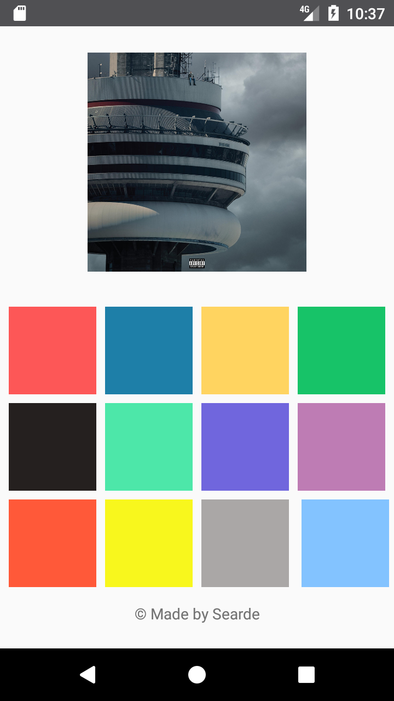

# Drakes_Drumkit

 
A Soundboard/Drum Pad app inspired by Roli Blocks and drum machines such as the Akai MPC2500  

<b> What Did I Learn? </b>
<ul>
<li> Using ImageButtons</li>
<li> Importing and extracting resources using SoundPool</li>
<li> Playing audio files in an Android Application</li>
</ul>
  

<b> Screenshot </b>
  

